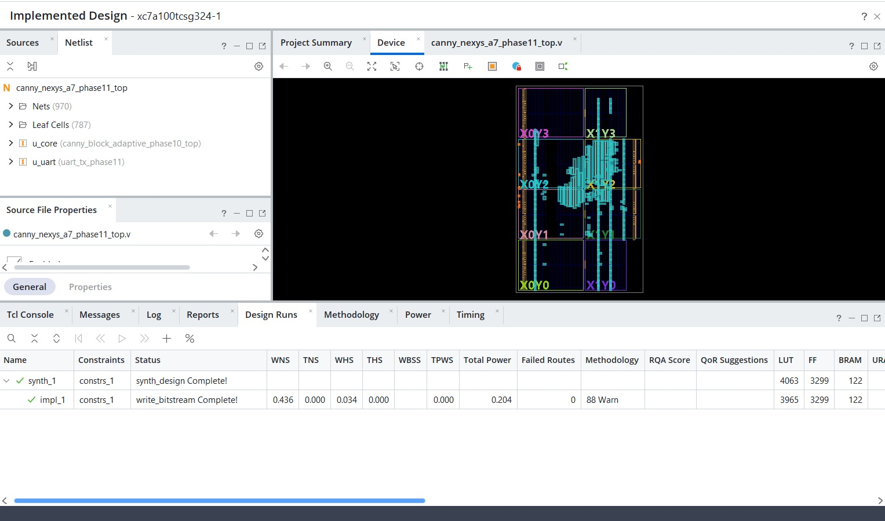
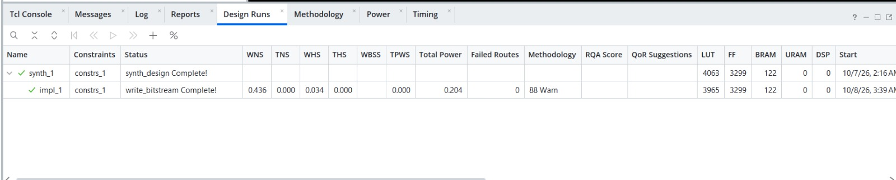
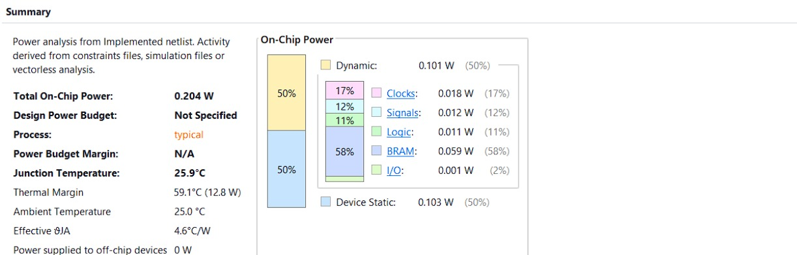

# Resource-Scalable Block-Adaptive Canny Edge Detector on Artix-7

A Verilog implementation of a **block-adaptive Canny edge detector** targeting the Xilinx Artix-7 XC7A100T FPGA.

The design combines a streaming Canny front end with local histogram-based adaptive thresholds and was evaluated across multiple block sizes, histogram resolutions, and adaptive-engine counts. A bit-accurate Python model is used as the verification reference.

The final configuration uses:

- 640×480 8-bit grayscale input
- 32×32 adaptive blocks
- 32-bin local magnitude histograms
- one adaptive threshold engine
- 100 MHz target clock
- Xilinx Artix-7 XC7A100T-1CSG324C

---

## Architecture

```text
8-bit grayscale image
        │
        ▼
    Gaussian filter
        │
        ▼
       Sobel
        │
        ▼
 Fixed-point CORDIC
        │
        ▼
Non-maximum suppression
        │
        ▼
32×32 local histogram
        │
        ▼
Adaptive HIGH / LOW thresholds
        │
        ▼
One-pass local weak-edge promotion
        │
        ▼
   1-bit edge map
```

The histogram is built from **nonzero post-NMS 11-bit magnitudes**.

For each block, the adaptive threshold logic selects a histogram bin corresponding approximately to the strongest 20% of nonzero candidates. The lower boundary of the selected bin becomes `HIGH`, and:

```text
LOW = floor(2 × HIGH / 5)
```

Threshold comparisons use strict `>` semantics.

The hardware's final edge-linking stage is **one-pass local weak-edge promotion**, not full recursive Canny hysteresis. Recursive 8-connected hysteresis is retained only as a software quality reference.

---

## Example output

The final board-wrapper simulation processes a stored 640×480 grayscale image and reconstructs the packed 1-bit edge map through the simulated UART packet path.

### Input image


### Reconstructed edge output


The reconstructed frame was compared against the expected reference:

```text
pixels=307200
payload_bytes=38400
processing_cycles=339885
processing_ms=3.39885
mismatches=0
checksum=PASS
status=PASS

---

## Final configuration

The design space included:

- 32×32 and 64×64 blocks
- 8, 16 and 32 histogram bins
- 1, 2 and 4 adaptive threshold engines

All tested adaptive-engine counts produced the same tested edge results.

Replicating adaptive engines increased FPGA resource use but did **not** improve end-to-end frame cadence because the architecture still uses a shared one-pixel-per-clock input front end and ordered one-pixel-per-clock output path.

For that reason, the final implementation uses:

```text
Block size       : 32 × 32
Histogram bins   : 32
Adaptive engines : 1
```

---

## Verification

The RTL was compared against a bit-accurate Python reference model at multiple stages of the pipeline.

| Check | Status |
| --- | --- |
| Bit-accurate Python reference vs RTL core | PASS |
| Frame-border regression | PASS |
| Runtime global-threshold regression | PASS |
| CORDIC numerical regression | PASS |
| Block-adaptive RTL/model comparison | PASS |
| 1/2/4-engine equivalence | PASS |
| Final core regression | PASS: 614,400 pixels, 0 mismatches |
| Board-wrapper RTL simulation | PASS: 307,200 pixels, 0 mismatches |
| Simulated UART packet reconstruction | PASS: 307,200 pixels, 0 mismatches |
| Post-synthesis functional check | PARTIAL PASS: 2,100 pixels |
| Post-route functional simulation | PASS: 307,200 pixels, 0 mismatches |
| 100 MHz routed static timing | PASS |
| Final routed DRC | PASS |
| Bitstream generation | PASS |
| Post-route SDF timing simulation | UNRESOLVED: BRAM hold warnings |
| Physical FPGA programming | NOT PERFORMED |
| Physical UART capture | NOT PERFORMED |
| Physical power measurement | NOT PERFORMED |

The final two-frame core regression reported:

```text
PHASE10_RTL_PASS engines=1 suite=two frames=2 pixels=614400
blocks=600 mismatches=0 unknowns=0
```

The final board-wrapper simulation reported:

```text
PHASE11_WRAPPER_PASS
input=307200
output=307200
mismatches=0
unknowns=0
processing_cycles=339885
```

The UART packet simulation and host-side reconstruction also compared all 307,200 pixels with zero mismatches.

---

## FPGA implementation results

Target FPGA:

```text
XC7A100T-1CSG324C
```

Target clock:

```text
100 MHz
```

### Post-route implementation



Final routed timing:

| Metric | Result |
| --- | ---: |
| Worst setup slack (WNS) | **+0.436 ns** |
| Total negative slack (TNS) | **0.000 ns** |
| Worst hold slack (WHS) | **+0.034 ns** |
| Total hold slack (THS) | **0.000 ns** |
| Failing timing endpoints | **0** |
| Failed routes | **0** |

Vivado reports:

```text
All user specified timing constraints are met.
```

Bitstream generation completed successfully for the XC7A100T.

### Implementation resources



---

## Resource scaling

| Design | LUT | FF | LUTRAM | BRAM18 equivalents | DSP | Routed WNS |
| --- | ---: | ---: | ---: | ---: | ---: | ---: |
| Adaptive core, E=1 | 3,834 | 3,059 | 645 | 52 | 0 | +0.960 ns |
| Adaptive core, E=2 | 6,058 | 4,252 | 1,285 | 96 | 0 | +0.675 ns |
| Adaptive core, E=4 | 10,299 | 6,627 | 2,565 | 184 | 0 | +0.644 ns |
| Final E=1 board wrapper | 4,063 | 3,299 | 644 | 244 / 270 | 0 | +0.436 ns |

The final wrapper uses approximately **90.4% of the device's BRAM18-equivalent capacity**.

Approximate BRAM18-equivalent usage:

```text
Algorithm core      : 52
Input image storage : 160
Packed output frame : 32
-------------------------
Total               : 244
```

Vivado's GUI reports 122 BRAM tiles because one RAMB36 tile corresponds to two RAMB18 equivalents.

The high wrapper-level BRAM use therefore includes the complete test-image ROM and packed output frame buffer; it is not solely the Canny processing core.

---

## Adaptive-engine scaling

The multi-engine experiment showed that duplicating adaptive threshold engines did not improve system-level throughput.

Measured adaptive-service and frame-start cadence remained:

```text
E=1 : 318,968-cycle frame-start cadence
E=2 : 318,968-cycle frame-start cadence
E=4 : 318,968-cycle frame-start cadence
```

At 100 MHz, this corresponds analytically to approximately:

```text
313.51 frame starts / second
```

This is a **core cadence estimate**, not measured camera throughput or physical-board FPS.

The result identifies the shared one-pixel-per-clock front end and ordered output path as the system bottleneck.

---

## Power estimate

Vivado's post-route vectorless estimate reported:

```text
Device static : 0.103 W
Dynamic       : 0.101 W
Total         : 0.204 W
```



This is a **low-confidence vectorless FPGA power estimate**.

It is not a physical-board power measurement.

---

## Nexys A7 board wrapper

The final wrapper targets the **Digilent Nexys A7-100T** and contains:

- stored 640×480 grayscale test-image ROM
- raster stream generator
- block-adaptive Canny core
- packed 1-bit output frame memory
- processing-cycle counter
- USB-UART packet transmitter

It does **not** contain:

- a camera interface
- HDMI input/output
- Ethernet
- Zynq processing system

A bitstream was generated successfully, but a physical Nexys A7 board was not available for final hardware testing.

Therefore this project does **not** claim:

- measured physical-board FPS
- measured board processing latency
- measured UART throughput
- measured board power
- successful physical FPGA deployment

---

## Reproducing the final checks

The final flow was reproduced from a clean clone using:

- Windows PowerShell
- Python 3
- AMD Vivado 2026.1

Set the Vivado binary directory first:

```powershell
$env:VIVADO_BIN = "C:\AMDDesignTools\2026.1\Vivado\bin"
```

### 1. Generate and verify Phase 11 assets

```powershell
python scripts/phase11/generate_assets.py
python scripts/phase11/verify_sync_core.py
python host/phase11/test_protocol.py
```

Expected synchronization result:

```text
PHASE11_SYNC_COPY_PASS modules=12 reset_sensitivity_changes=19 other_byte_changes=0
```

---

### 2. Generate Phase 6 streams

Later regressions depend on generated Phase 6 streams:

```powershell
& scripts/phase6/run_trace.ps1 -Suite fixed
& scripts/phase6/run_trace.ps1 -Suite isolate
```

These generate:

```text
results/phase6/fixed.stream
results/phase6/isolate.stream
```

---

### 3. Generate Phase 8 oracle data

```powershell
python scripts/phase8/prepare_adaptive_oracle.py
python scripts/phase8/prepare_suite.py --suite isolate
```

These generate, among other files:

```text
results/phase8/adaptive_nms.mem
results/phase8/isolate_nms.mem
```

---

### 4. Generate Phase 9 regression vectors

```powershell
python scripts/phase9/prepare_rtl_oracle.py --block 32 --bins 32 --suite two
python scripts/phase9/prepare_rtl_oracle.py --block 32 --bins 32 --suite isolate
```

Expected markers include:

```text
PHASE9_ORACLE_PASS size=32 bins=32 suite=two
PHASE9_ORACLE_PASS size=32 bins=32 suite=isolate
```

---

### 5. Run the final core regression

```powershell
& scripts/phase11/run_core_regression.ps1
```

Expected final marker:

```text
PHASE10_RTL_PASS engines=1 suite=two frames=2 pixels=614400
blocks=600 mismatches=0 unknowns=0
```

---

### 6. Run the board-wrapper and UART simulation

```powershell
& scripts/phase11/run_wrapper_sim.ps1 -Test monkey -CaptureUart
```

Expected markers include:

```text
PHASE11_WRAPPER_PASS
PHASE11_UART_PACKET_PASS
```

Reconstruct the simulated UART output:

```powershell
python host/phase11/capture_board_output.py `
  --packet results/phase11/sim_uart_packet.bin `
  --output results/phase11/sim_uart_reconstruction.png
```

---

### 7. Build the final Vivado implementation

```powershell
& scripts/phase11/run_vivado.ps1
```

This builds the final XC7A100T project, performs synthesis and implementation, and produces timing, utilization, DRC and power reports.

---

### 8. Generate the bitstream

```powershell
& scripts/phase11/run_bitstream.ps1
```

The reproduced build completed with:

```text
PHASE11_BITSTREAM_READY=results/phase11/canny_nexys_a7.bit WNS=0.436
```

The bitstream script checks routed timing and DRC before writing the `.bit` file.

---

## Repository structure

```text
rtl/
    phase11/        Final synthesizable board-wrapper RTL
    phase10/        Multi-engine adaptive architecture
    phase9/         Parameterized adaptive design-space RTL

model/
    Bit-accurate Python reference models and regressions

tb/
    RTL testbenches

scripts/
    Reproduction, simulation, synthesis and implementation scripts

constraints/
    Nexys A7 / Artix-7 constraints

host/
    UART packet decoder and output reconstruction

docs/
    Architecture, verification, results and limitations

reports/
    Selected experiment and implementation reports
```

Generated Vivado projects, simulation databases and large generated vector files are intentionally excluded from normal Git tracking.

---

## Known limitation: SDF timing simulation

Post-route static timing analysis closes successfully at 100 MHz, and the routed design has zero final DRC findings.

However, the post-route **SDF timing simulation remains unresolved** because repeated BRAM hold warnings prevent a useful full-frame timing-simulation result.

Those warnings were not suppressed.

See:

[Phase 11V no-board validation report](reports/PHASE11V_NO_BOARD_VALIDATION.md)

Static timing analysis and post-route functional simulation both pass, but the unresolved SDF discrepancy remains documented.

---

## Bitstream

A final bitstream was successfully generated for:

```text
xc7a100tcsg324-1
```

Recorded SHA-256:

```text
c8e04b06d54fa59b0cda3ac7c219da78766021f0e91fa43d4c7b85b5e5d9513d
```

See:

[Bitstream identity record](reports/phase11v/bitstream_identity.txt)

The bitstream is not treated as normal source code, and physical-board validation was not performed.

---

## Documentation

Additional details are available in:

- [Architecture](docs/architecture.md)
- [Verification](docs/verification.md)
- [Results](docs/results.md)
- [Limitations](docs/limitations.md)
- [References](docs/references.md)

---

## Project status

**Complete — RTL and Python models verified, post-route implementation validated, 100 MHz timing closed, and an Artix-7 bitstream generated. Physical-board validation was not performed, and the post-route SDF timing-simulation discrepancy remains unresolved.**
